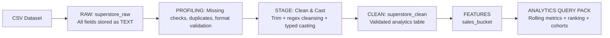
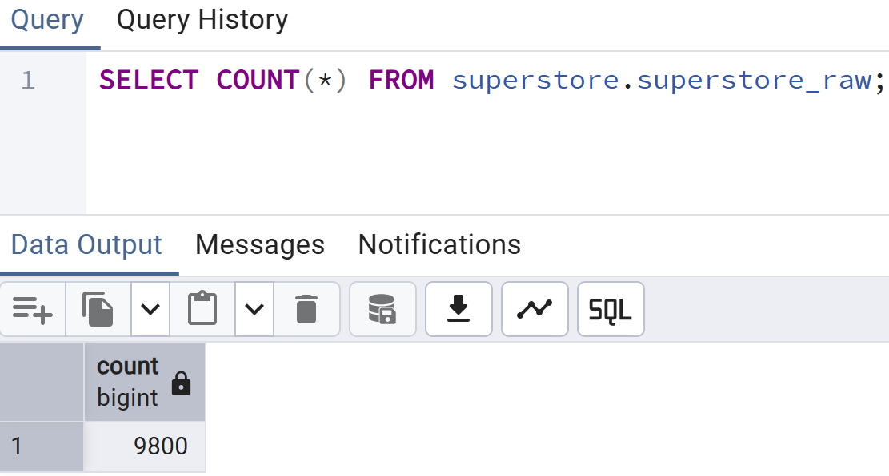
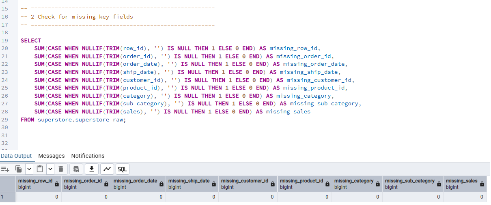
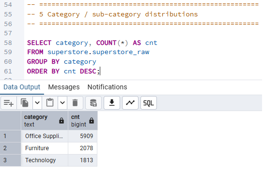
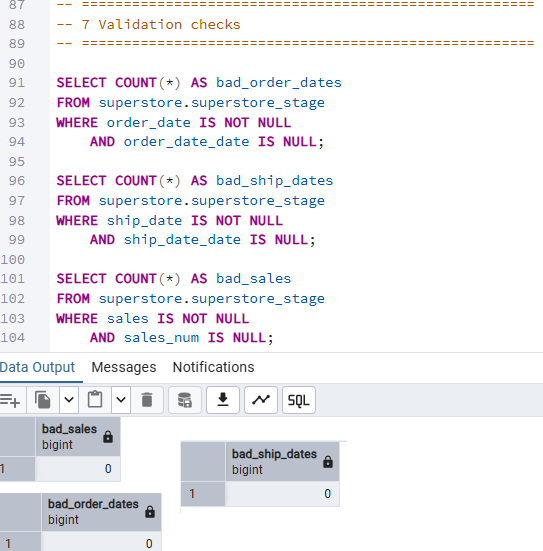
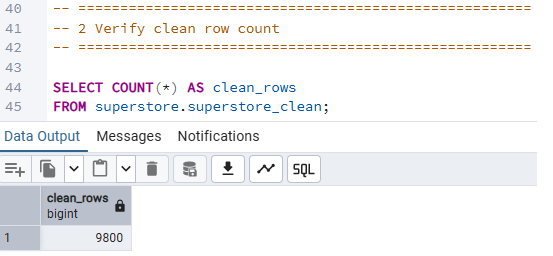
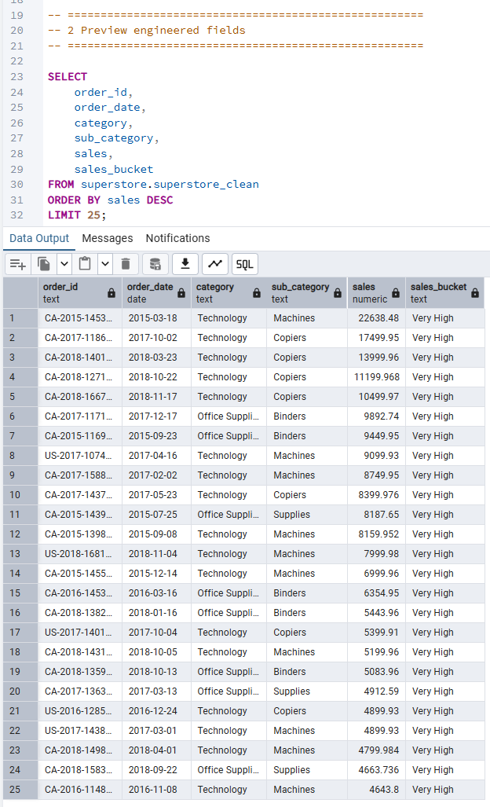
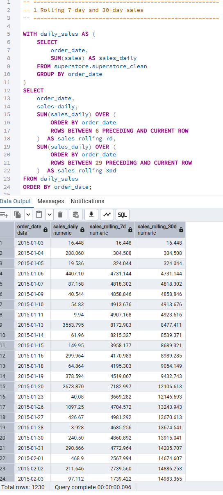
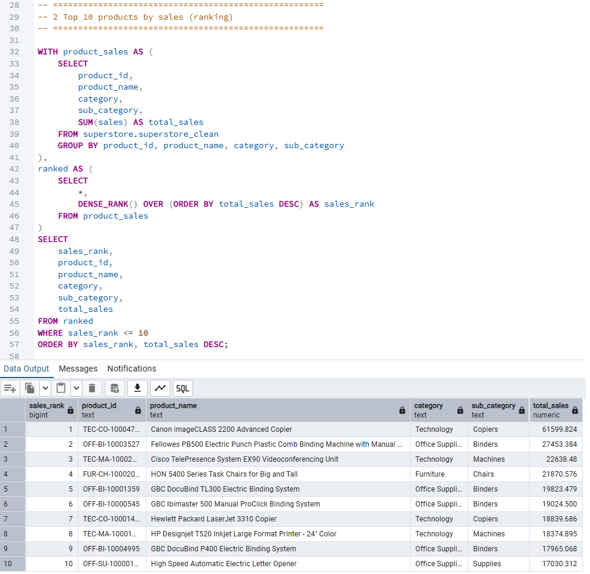
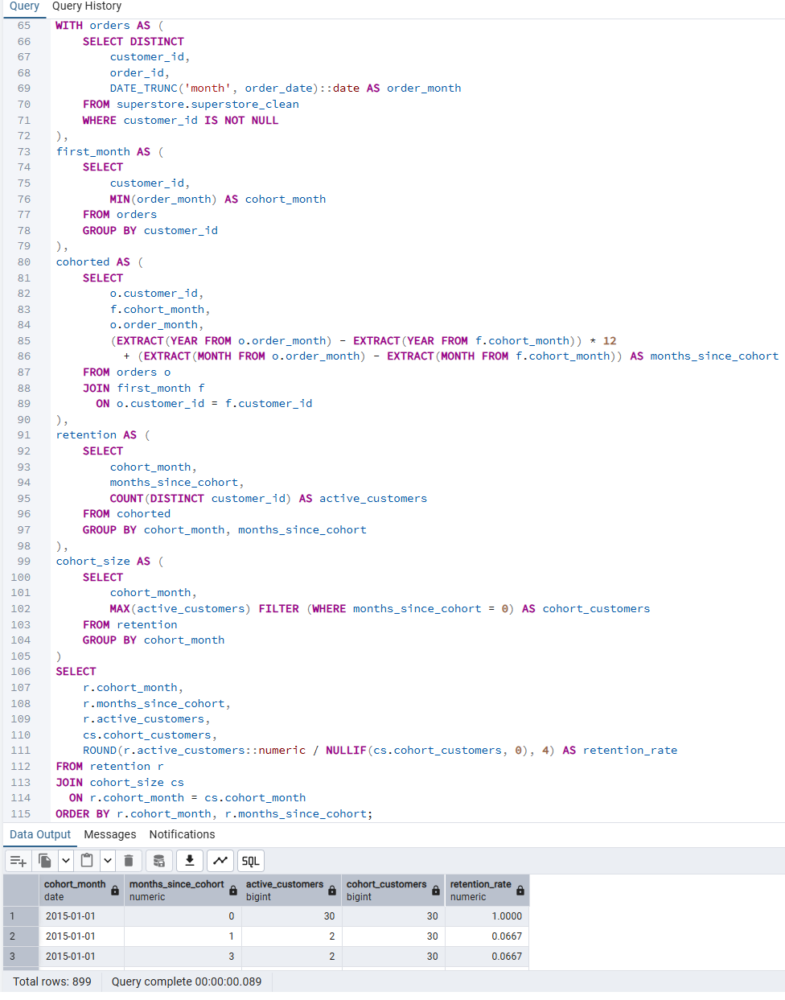

# Superstore Analytics Query Pack (PostgreSQL)

## Project Overview
This project demonstrates advanced SQL analytics techniques in PostgreSQL using a structured, production-style ETL workflow.

The objective was to ingest raw transactional data, perform structured data validation and transformation, and apply business-oriented analytical queries using CTEs and window functions.

**Pipeline:**   
Raw → Profiling → Stage → Clean → Feature Engineering → Analytics Query Pack  

This layered architecutre preserves raw data integrity while enabling safe transformation and scalable analytical querying.

---

## Architecture Diagram



--- 

## Tools Used

- PostgreSQL
- pgAdmin
- SQL
- VS Code
- GitHub

--- 

## Dataset Summary

- Raw rows ingested: **9,800**
- Clean rows produced: **9,800**

The dataset includes: 

- Orders (order_id, order_date, ship_date, ship_mode)
- Customers (customer_id, segment, region)
- Products (category, sub_category, product_name)
- Sales (sales)

---

## Screenshots

### Raw import row count: 



### Profiling outputs: 




### Stage validation: 



### Clean row count: 



### Feature preview: 



### Rolling metrics: 



### Product ranking: 



### Cohort retention: 



---

## Analytics Queries Included

All queries are written using Common Table Expressions (CTEs) and window fucntions to demonstrate production-level analytical SQL patterns.

**1. Rolling 7- and 30-day sales**

Business question: "How are daily sales trending over time?"

**2. Top 10 products by sales (ranking)**

Business question: "Which products generate the most sales?"

**3. Cohort retention (monthly)**

Business question: "Do customers return in later months after their first purchase month?"

---

## Repo Structure

```
DATA/  
IMAGES/ 
SQL/  
README.md  
```